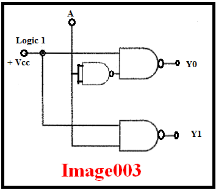

## <b> Post-test</b>
#### Please attempt the following questions

<pre>
1) The figure in image003, represents a ___________.

    a. 1:2 mux
    b. 1:2 demux
    <b>c. 1:2 decoder</b>
    d. none of these

2) In figure image003, when control input A = 0,
    a. Y0 = 0, Y1 = 0
    <b>b. Y0 = 0, Y1 = 1</b>
    c. Y0 = 1, Y1 = 0
    d. Y0 = 1, Y1 = 1

3) In figure image003, when control input A = 1,
    a. Y0 = 0, Y1 = 0
    b. Y0 = 0, Y1 = 1
    <b>c. Y0 = 1, Y1 = 0</b>
    d. Y0 = 1, Y1 = 1

4) In figure image003, what value of A will result in Y0 = Y1=0?
    a. A = 0
    b. A = 1
    c. A = x
    <b>d. not possible</b>

5) Higher order demux/decoders can be built using lower order demux/decoders. State True or False.
    <b>a. True</b>
    b. False

</pre>