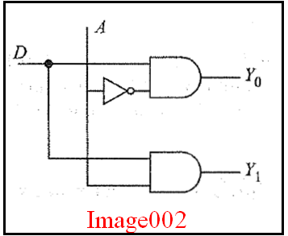

## <b> Pre-test</b>
#### Please attempt the following questions

<pre>
1) In the figure shown in image002, a ______________is shown using basic logic gates.

    a. 1:2 mux
    b. 2:1 mux
    c. 2:1demux
    <b>d. 1:2 demux</b>

2) In figure image002, what is the output if A = 0 and D = 1?
    a. Y0 = 0, Y1 =1 
    <b>b. Y0 = 1, Y1 = 0</b>
    c. Y0 = 0, Y1 =0
    d. Y0 = 1, Y1 =0

3) In figure image002, what is the output if A = 0 and D = 0?
    a. Y0 = 0, Y1 =1 
    b. Y0 = 1, Y1 = 0
    <b>c. Y0 = 0, Y1 =0</b>
    d. Y0 = 1, Y1 =0

4) In figure image002, what is the output if A = 1 and D = 0?
    a. Y0 = 0, Y1 =1 
    b. Y0 = 1, Y1 = 0
    <b>c. Y0 = 0, Y1 =0</b>
    d. Y0 = 1, Y1 =0

5) In figure image002, what is the output if A = 1 and D = 1?
    <b>a. Y0 = 0, Y1 =1</b>
    b. Y0 = 1, Y1 = 0
    c. Y0 = 0, Y1 =0
    d.Y0 = 1, Y1 =0

</pre>