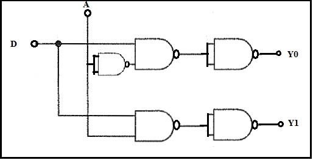
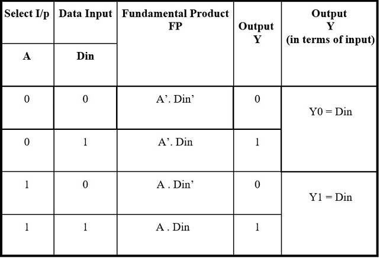
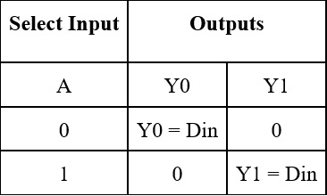
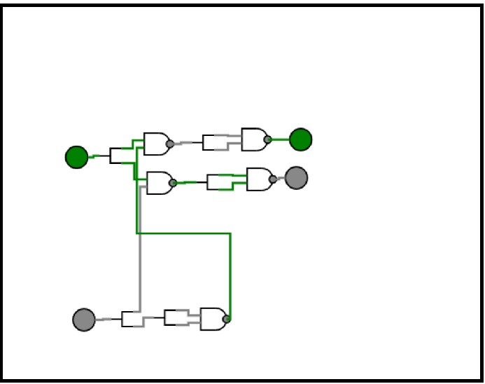
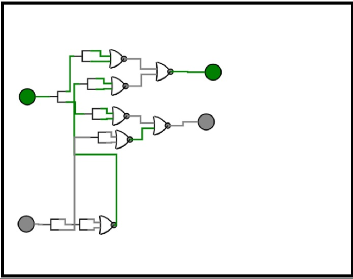

<justify>
<b>1.1. Introduction</b>
 
A demultiplexer is a logic circuit with one input and multiple outputs.  Whereas a 2:4 decoder is a logic circuit that accepts a 2-bit binary number and indicates its decimal equivalent (between 0 & 3) at the output. TTL ICs such as 74LS155, 74LS138 and 74LS154 are 2:4, 3:8 and 4:16 type decoder ICs respectively. They are also referred to as 1-to-4, 1-to-8 and 1-to-16 type demultiplexers.
In case of a decoder there is no data input. The select lines/control bits are the only inputs. IC 74LS154 can be used as a decoder-demultiplexer IC as it performs both operations.

<b>1.2</b> Design a 1:2 demux using basic universal logic gates.
NAND & NOR gates are called as universal logic gates. The 1:2 demux logic can be implemented using only NAND gates.

<b>CONCEPT:</b> 
Whenever both the inputs of NAND gate are tied together as single input, it works as a NOT gate. Whereas a NAND gate followed by a NOT gate gives an AND logic. Using these concepts a 1:2 demux can be designed as shown in figure 

 

 

The function table of a 1:2 demux is tabulated.
	Function table	
	
 

 

The expressions for outputs Y0 & Y1 can be formulated by considering only those FPs for which the output is 1.
Y0 = A’. Din
Y1 = A . Din
The simplified function can be tabulated as:

 

 

Using universal logic gates a 1:2 demux can be constructed as shown in the figures 
<b>1.Using NAND gates</b>

 

 

<b>2.Using NOR gates</b>

 

 

</justify>